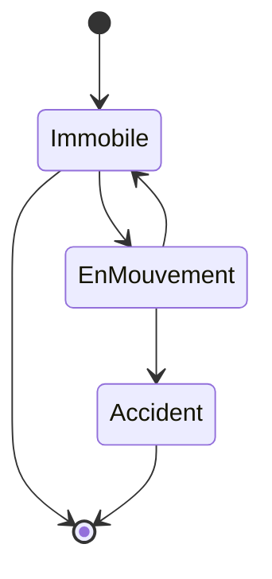
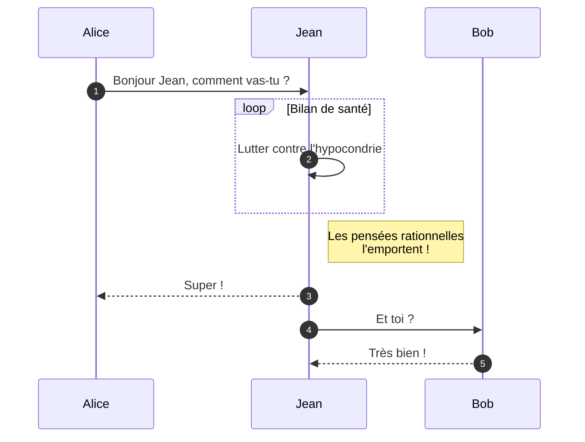
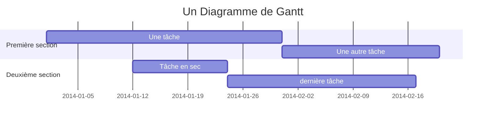
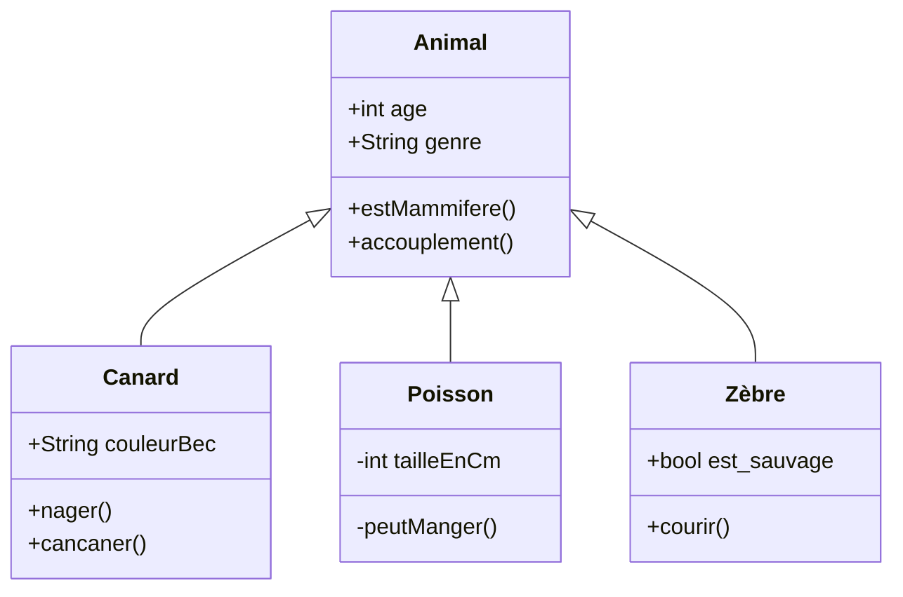
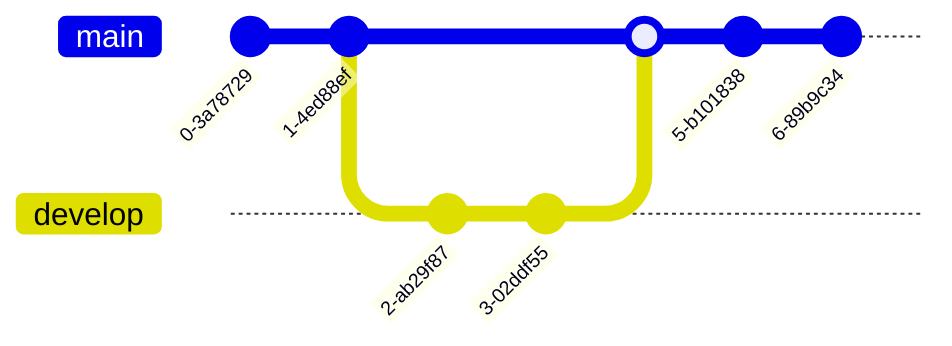

Cet article montre comment écrire et afficher des diagrammes **Mermaid** directement dans vos fichiers Markdown et MDX. Puisque nous utilisons `mermaid: true` dans le frontmatter, la bibliothèque client Mermaid n'est chargée que sur cette page, gardant le reste du site léger et sans JavaScript.

Voici plusieurs exemples de diagrammes complexes, allant des organigrammes aux diagrammes de Gantt !

## Diagramme d'état

Pour afficher un diagramme, placez votre code Mermaid dans un bloc de code avec l'identifiant de langage `mermaid` :

````markdown

````

Ce qui s'affiche automatiquement ainsi :


## Diagramme de Séquence



## Diagramme de Gantt



## Diagramme de Classes



## Graphe Git


